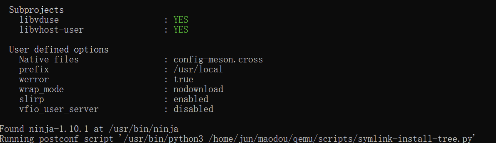
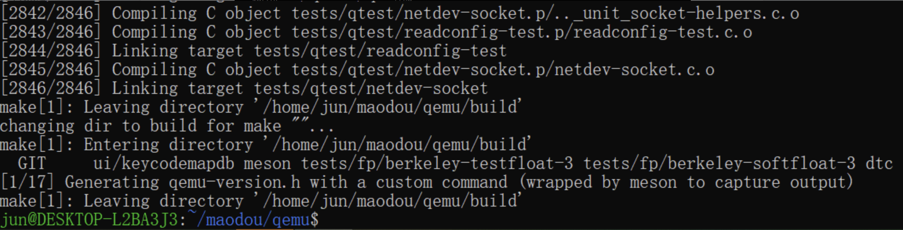
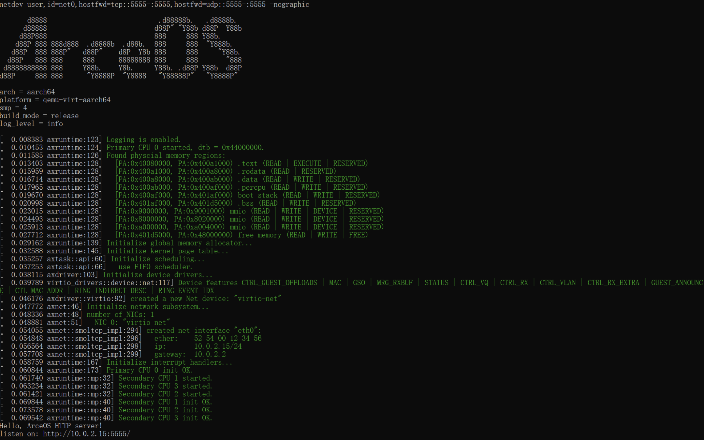
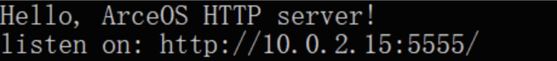
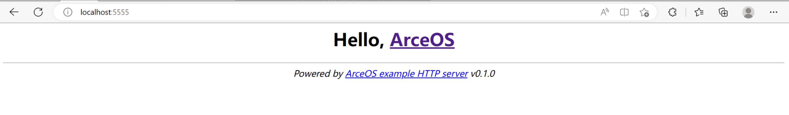
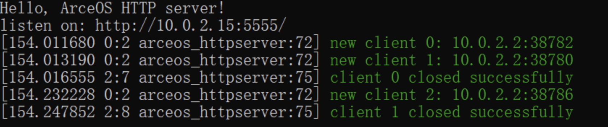

# 任务四：ArceOS + virtio-net 网卡驱动 in Qemu for AArch64/RISC-V 验证

1.  配置

    ```shell
    # qemu目录下
    sudo apt-get install libslirp-dev
    sudo apt install flex
    sudo apt install bison
    ./configure --target-list=aarch64-softmmu --enable-slirp    # 用于 AArch64 架构
    ./configure --target-list=riscv64-softmmu --enable-slirp    # 用于 RISC-V 架构
    ```



2.  编译
    ```shell
    # qemu目录下
    make
    ```



3.  运行

    ```shell
    # arceos目录下
    make A=apps/net/httpserver ARCH=aarch64 LOG=info NET=y SMP=4 run  # 用于 AArch64 架构
    make A=apps/net/httpserver ARCH=riscv64 LOG=info NET=y SMP=4 run  # 用于 RISC-V 架构
    ```



成功后显示得到的网址



访问 localhost:(端口号)，得到:



同时查看终端中更新的 Log:


