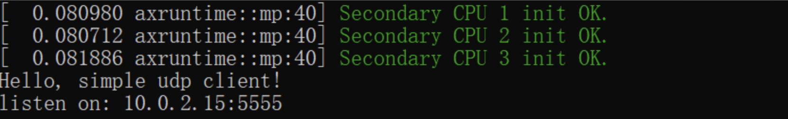
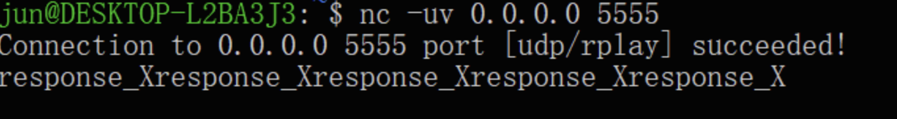
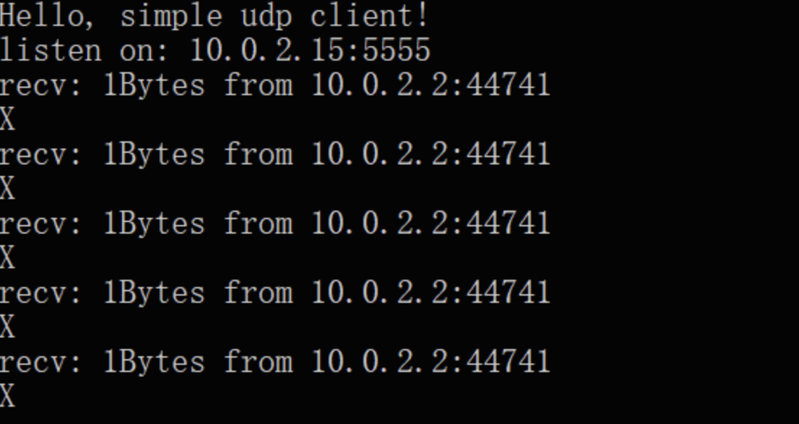
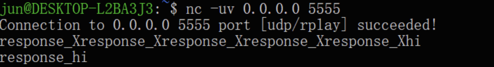
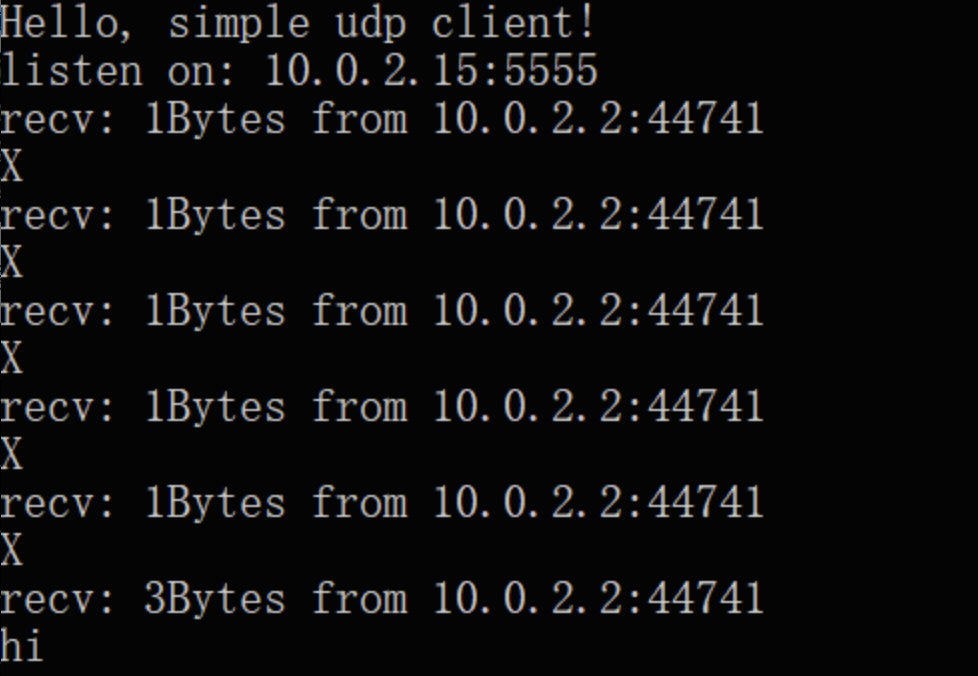

# 任务五：ArceOS + 网卡驱动 + UDP 发包应用程序 验证

吴大帅在ArceOS上做的UDP开发工作:
1.  仓库: https://github.com/reflyable/arceos-udp
2.  报告: https://github.com/reflyable/arceos-udp/tree/report/report

---

1.  编译运行

    ```shell
    # arceos目录下
    make A=apps/net/udpserver ARCH=aarch64 LOG=info NET=y SMP=4 run
    ```

    运行成功出现如下结果

    

2.  打开新的终端，输入
    
    ```shell
    nc -uv 0.0.0.0  (port number)
    ```

    其中`port number`为步骤一结果图中最后一行显示的端口号，在本例中此处输入

    ```shell
    nc -uv 0.0.0.0 5555
    ```

    若上述命令成功执行，则客户端输出如下

    

    服务器端输出如下

    

    此时在客户端键入任何文本，都会收到回复，例如输入`hi`后换行

    客户端显示输出如下

    

    服务器端输出如下

    