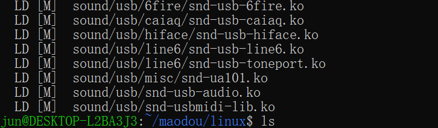
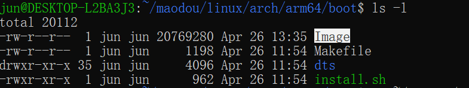

# 任务一：Linux 6.1 in x86/AArch64 编译

1.  克隆仓库
    
    ```shell
    # 全部文件总计约为3.40GiB
    git clone https://github.com/raspberrypi/linux.git
    ```

    依据 [linux/changes.rst at rpi-6.1.y · raspberrypi/linux (github.com)](https://github.com/raspberrypi/linux/blob/rpi-6.1.y/Documentation/process/changes.rst) 安装或更新所需的软件

2.  安装交叉编译所需的依赖:
    
    ```shell
    sudo apt install git bc bison flex libssl-dev make libc6-dev libncurses5-dev libelf-dev
    ```

3.  安装交叉编译器
    
    ```shell
    sudo apt install crossbuild-essential-arm64
    ```

4.  配置编译目标
    
    ```shell
    cd linux
    KERNEL=kernel7
    make menuconfig # 进入之后按照菜单栏顶部说明移动选项至SAVE保存生成.config文件
    make ARCH=arm64 CROSS_COMPILE=aarch64-linux-gnu- bcmrpi3_defconfig
    ```

    编译配置的默认参数bcmrpi3_defconfig文件可以参考 <https://github.com/raspberrypi/linux/blob/rpi-6.1.y/arch/arm64/configs/bcmrpi3_defconfig>

5.  编译
    
    ```shell
    make -j4 ARCH=arm64 CROSS_COMPILE=aarch64-linux-gnu- Image modules dtbs
    ```

    编译结束后应显示：

    

6.  查看镜像位置
    
    

    上一步编译结束后，输入如下命令

    ```shell
    # linux目录下
    ls ./arch/arm64/boot
    ```

    可以看到对应目录下出现了`Image`镜像文件

    参考：[15分钟教你搞懂树莓派的Linux内核编译 - 知乎 (zhihu.com)](https://zhuanlan.zhihu.com/p/535947815)。