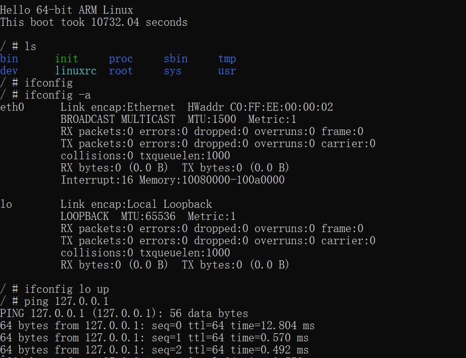
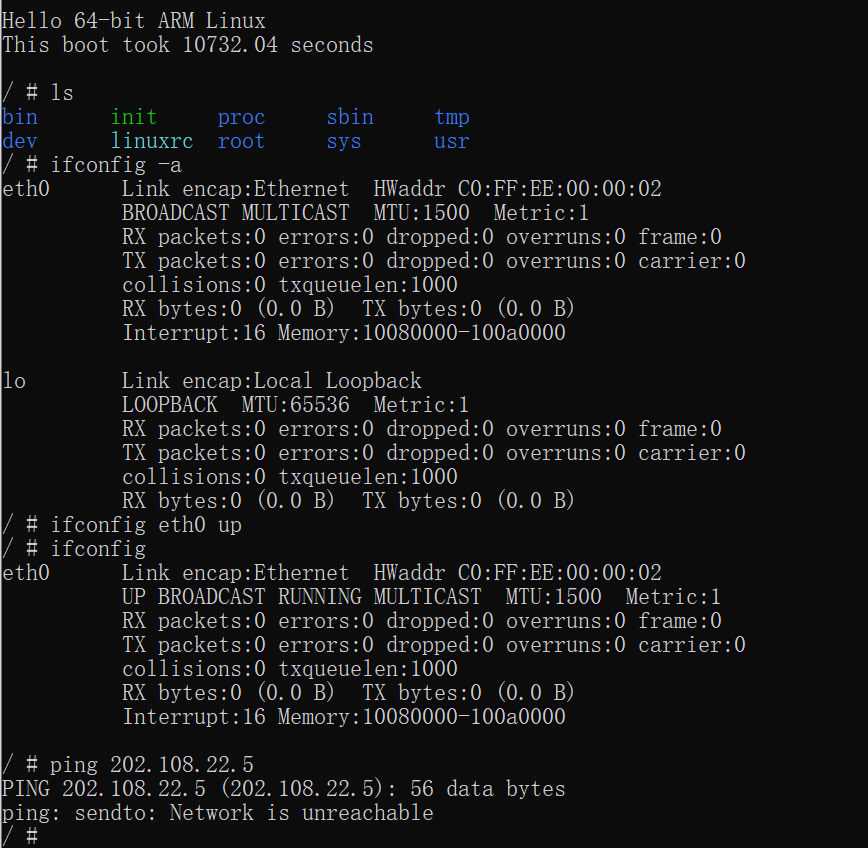
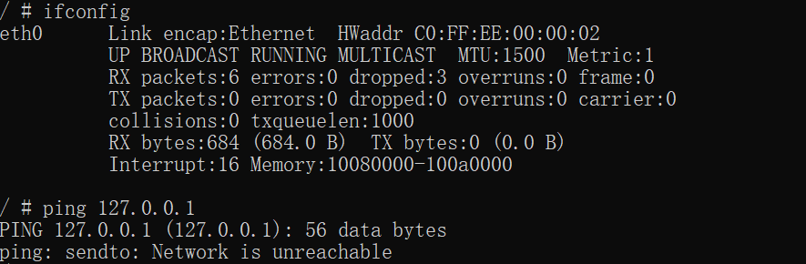
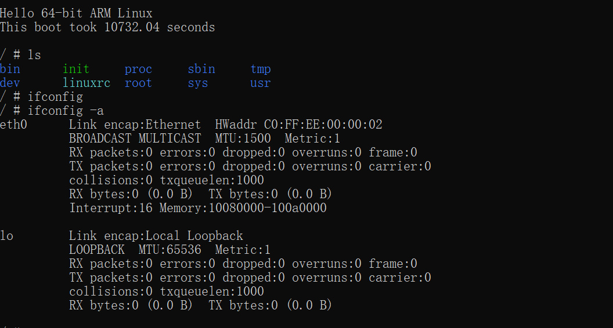
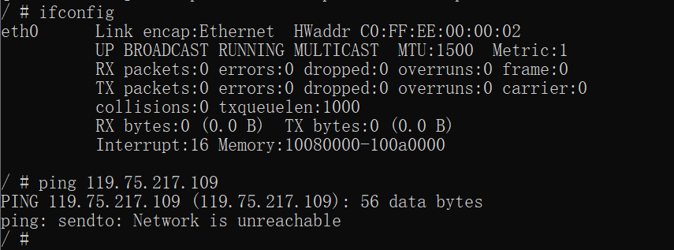
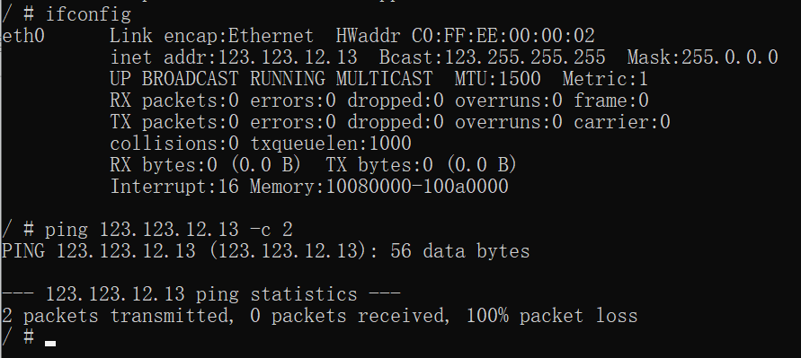
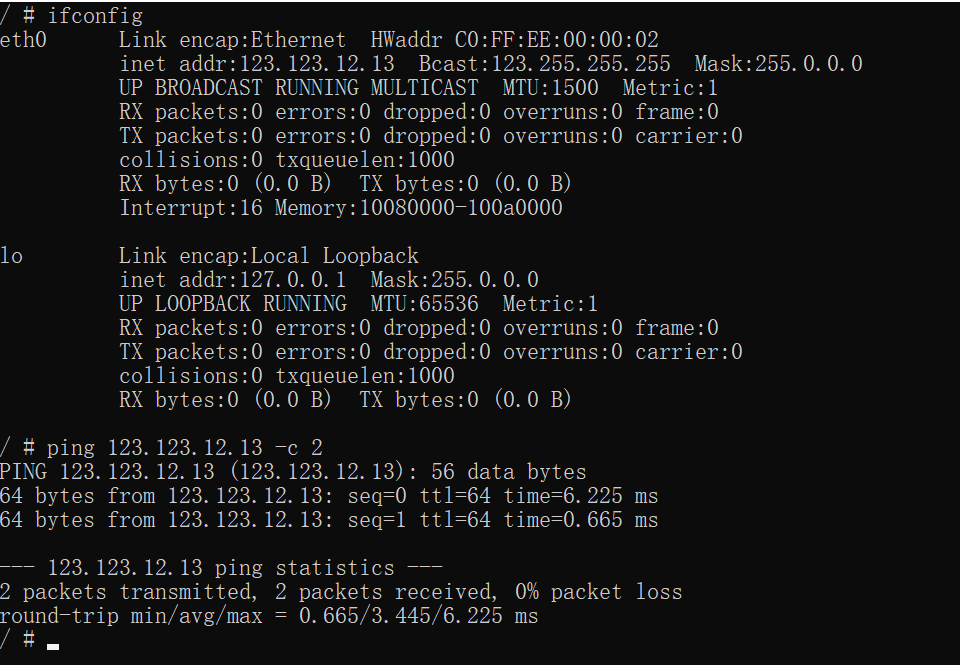

# 任务三：Linux 6.1 + 网卡驱动 在 Qemu for x86/AArch64 中运行

## 背景知识

[Linux镜像如何添加驱动,安装virtio驱动（Linux）](https://blog.csdn.net/weixin_42365401/article/details/116774301)

PCI：接口
`-netdev` 设置接口
NIC：网卡
`-device` 设置网卡

## 参考配置

[Qemu 模拟 E1000 网卡](https://www.qemu.org/docs/master/system/ppc/powernv.html?highlight=e1000)

> ## Boot options
> 
> Here is a simple setup with one e1000e NIC :
> 
> ```shell
> $ qemu-system-ppc64 -m 2G -machine powernv9 -smp 2,cores=2,threads=1 \
> -accel tcg,thread=single \
> -device e1000e,netdev=net0,mac=C0:FF:EE:00:00:02,bus=pcie.0,addr=0x0 \
> -netdev user,id=net0,hostfwd=::20022-:22,hostname=pnv \
> -kernel ./zImage.epapr  \
> -initrd ./rootfs.cpio.xz \
> -nographic
> ```

zCore 里面模拟了 e1000 网卡，qemu_opts 需要增加2行以指定 e1000

```shell
qemu_opts += \
	-netdev user,id=net1,hostfwd=tcp::8000-:80,hostfwd=tcp::2222-:2222,hostfwd=udp::6969-:6969 \
	-device e1000e,netdev=net1
```

参考：[Documentation/Networking - QEMU](https://wiki.qemu.org/Documentation/Networking)

- 重新执行

    ```shell
    make clean
    make ARCH=arm64 CROSS_COMPILE=aarch64-linux-gnu- bcmrpi3_defconfig
    make -j4  ARCH=arm64 CROSS_COMPILE=aarch64-linux-gnu- Image modules dtbs 
    ```

- 运行

    ```shell
    qemu-system-aarch64 -M virt -cpu cortex-a72 -smp 8 -m 128M -kernel (your Image path) -initrd (your initramfs.cpio.gz path) -nographic -netdev user,id=net0 -device e1000e,netdev=net0,mac=C0:FF:EE:00:00:02
    ```

    例如：

    ```shell
    qemu-system-aarch64 -M virt -cpu cortex-a72 -smp 8 -m 128M -kernel (your Image path) -initrd (your initramfs.cpio.gz path) -nographic -netdev user,id=net0 -device e1000e,netdev=net0,mac=C0:FF:EE:00:00:02
    ```

    `-netdev user`是设置网络接口为user，`-device`是指定网卡，此处是使用e1000e

    下面是运行结果：

    ```
    qemu-system-aarch64 -M virt -cpu cortex-a72 -smp 8 -m 128M -kernel /home/jun/maodou/linux/arch/arm64/boot/Image -initrd /home/jun/maodou/busybox-1.35.0/initramfs.cpio.gz -nographic -netdev user,id=net0 -device e1000e,netdev=net0,mac=C0:FF:EE:00:00:02
    [    0.000000] Booting Linux on physical CPU 0x0000000000 [0x410fd083]
    [    0.000000] Linux version 6.1.25-gfc30a915ea61-dirty (jun@DESKTOP-L2BA3J3) (aarch64-linux-gnu-gcc (Ubuntu 11.3.0-1ubuntu1~22.04) 11.3.0, GNU ld (GNU Binutils for Ubuntu) 2.38) #6 SMP PREEMPT Sun Apr 30 13:48:59 CST 2023
    [    0.000000] Machine model: linux,dummy-virt
    [    0.000000] efi: UEFI not found.
    [    0.000000] NUMA: No NUMA configuration found
    [    0.000000] NUMA: Faking a node at [mem 0x0000000040000000-0x0000000047ffffff]
    [    0.000000] NUMA: NODE_DATA [mem 0x47fafa00-0x47fb1fff]
    [    0.000000] Zone ranges:
    [    0.000000]   DMA      [mem 0x0000000040000000-0x0000000047ffffff]
    [    0.000000]   DMA32    empty
    [    0.000000]   Normal   empty
    [    0.000000] Movable zone start for each node
    [    0.000000] Early memory node ranges
    [    0.000000]   node   0: [mem 0x0000000040000000-0x0000000047ffffff]
    [    0.000000] Initmem setup node 0 [mem 0x0000000040000000-0x0000000047ffffff]
    [    0.000000] cma: Reserved 32 MiB at 0x0000000045c00000
    [    0.000000] psci: probing for conduit method from DT.
    [    0.000000] psci: PSCIv0.2 detected in firmware.
    [    0.000000] psci: Using standard PSCI v0.2 function IDs
    [    0.000000] psci: Trusted OS migration not required
    [    0.000000] percpu: Embedded 20 pages/cpu s44840 r8192 d28888 u81920
    [    0.000000] Detected PIPT I-cache on CPU0
    [    0.000000] CPU features: detected: Spectre-v2
    [    0.000000] CPU features: detected: Spectre-v3a
    [    0.000000] CPU features: detected: Spectre-v4
    [    0.000000] CPU features: detected: Spectre-BHB
    [    0.000000] CPU features: kernel page table isolation forced ON by KASLR
    [    0.000000] CPU features: detected: Kernel page table isolation (KPTI)
    [    0.000000] CPU features: detected: ARM erratum 1742098
    [    0.000000] CPU features: detected: ARM errata 1165522, 1319367, or 1530923
    [    0.000000] alternatives: applying boot alternatives
    [    0.000000] Fallback order for Node 0: 0
    [    0.000000] Built 1 zonelists, mobility grouping on.  Total pages: 32256
    [    0.000000] Policy zone: DMA
    [    0.000000] Kernel command line:
    [    0.000000] Dentry cache hash table entries: 16384 (order: 5, 131072 bytes, linear)
    [    0.000000] Inode-cache hash table entries: 8192 (order: 4, 65536 bytes, linear)
    [    0.000000] mem auto-init: stack:off, heap alloc:off, heap free:off
    [    0.000000] Memory: 56008K/131072K available (16064K kernel code, 3706K rwdata, 8836K rodata, 7552K init, 609K bss, 42296K reserved, 32768K cma-reserved)
    [    0.000000] SLUB: HWalign=64, Order=0-3, MinObjects=0, CPUs=8, Nodes=1
    [    0.000000] rcu: Preemptible hierarchical RCU implementation.
    [    0.000000] rcu:     RCU event tracing is enabled.
    [    0.000000] rcu:     RCU restricting CPUs from NR_CPUS=256 to nr_cpu_ids=8.
    [    0.000000]  Trampoline variant of Tasks RCU enabled.
    [    0.000000]  Tracing variant of Tasks RCU enabled.
    [    0.000000] rcu: RCU calculated value of scheduler-enlistment delay is 25 jiffies.
    [    0.000000] rcu: Adjusting geometry for rcu_fanout_leaf=16, nr_cpu_ids=8
    [    0.000000] NR_IRQS: 64, nr_irqs: 64, preallocated irqs: 0
    [    0.000000] Root IRQ handler: gic_handle_irq
    [    0.000000] GICv2m: range[mem 0x08020000-0x08020fff], SPI[80:143]
    [    0.000000] rcu: srcu_init: Setting srcu_struct sizes based on contention.
    [    0.000000] arch_timer: cp15 timer(s) running at 62.50MHz (virt).
    [    0.000000] clocksource: arch_sys_counter: mask: 0x1ffffffffffffff max_cycles: 0x1cd42e208c, max_idle_ns: 881590405314 ns
    [    0.000076] sched_clock: 57 bits at 63MHz, resolution 16ns, wraps every 4398046511096ns
    [    0.007920] Console: colour dummy device 80x25
    [    0.010044] printk: console [tty0] enabled
    [    0.012330] Calibrating delay loop (skipped), value calculated using timer frequency.. 125.00 BogoMIPS (lpj=250000)
    [    0.012500] pid_max: default: 32768 minimum: 301
    [    0.013262] LSM: Security Framework initializing
    [    0.016003] Mount-cache hash table entries: 512 (order: 0, 4096 bytes, linear)
    [    0.016065] Mountpoint-cache hash table entries: 512 (order: 0, 4096 bytes, linear)
    [    0.047451] cgroup: Disabling memory control group subsystem
    [    0.063952] cacheinfo: Unable to detect cache hierarchy for CPU 0
    [    0.070942] cblist_init_generic: Setting adjustable number of callback queues.
    [    0.071145] cblist_init_generic: Setting shift to 3 and lim to 1.
    [    0.071441] cblist_init_generic: Setting shift to 3 and lim to 1.
    [    0.072850] rcu: Hierarchical SRCU implementation.
    [    0.072904] rcu:     Max phase no-delay instances is 1000.
    [    0.078647] EFI services will not be available.
    [    0.080163] smp: Bringing up secondary CPUs ...
    [    0.083812] Detected PIPT I-cache on CPU1
    [    0.084409] cacheinfo: Unable to detect cache hierarchy for CPU 1
    [    0.084815] CPU1: Booted secondary processor 0x0000000001 [0x410fd083]
    [    0.089347] Detected PIPT I-cache on CPU2
    [    0.089523] cacheinfo: Unable to detect cache hierarchy for CPU 2
    [    0.089738] CPU2: Booted secondary processor 0x0000000002 [0x410fd083]
    [    0.091006] Detected PIPT I-cache on CPU3
    [    0.091154] cacheinfo: Unable to detect cache hierarchy for CPU 3
    [    0.091279] CPU3: Booted secondary processor 0x0000000003 [0x410fd083]
    [    0.092569] Detected PIPT I-cache on CPU4
    [    0.092704] cacheinfo: Unable to detect cache hierarchy for CPU 4
    [    0.092838] CPU4: Booted secondary processor 0x0000000004 [0x410fd083]
    [    0.094313] Detected PIPT I-cache on CPU5
    [    0.094455] cacheinfo: Unable to detect cache hierarchy for CPU 5
    [    0.094612] CPU5: Booted secondary processor 0x0000000005 [0x410fd083]
    [    0.096838] Detected PIPT I-cache on CPU6
    [    0.097059] cacheinfo: Unable to detect cache hierarchy for CPU 6
    [    0.097407] CPU6: Booted secondary processor 0x0000000006 [0x410fd083]
    [    0.098799] Detected PIPT I-cache on CPU7
    [    0.098941] cacheinfo: Unable to detect cache hierarchy for CPU 7
    [    0.099114] CPU7: Booted secondary processor 0x0000000007 [0x410fd083]
    [    0.099976] smp: Brought up 1 node, 8 CPUs
    [    0.100270] SMP: Total of 8 processors activated.
    [    0.100373] CPU features: detected: 32-bit EL0 Support
    [    0.100415] CPU features: detected: 32-bit EL1 Support
    [    0.100493] CPU features: detected: CRC32 instructions
    [    0.104523] CPU: All CPU(s) started at EL1
    [    0.104766] alternatives: applying system-wide alternatives
    [    0.134654] devtmpfs: initialized
    [    0.151198] clocksource: jiffies: mask: 0xffffffff max_cycles: 0xffffffff, max_idle_ns: 7645041785100000 ns
    [    0.151670] futex hash table entries: 2048 (order: 5, 131072 bytes, linear)
    [    0.156256] pinctrl core: initialized pinctrl subsystem
    [    0.167152] DMI not present or invalid.
    [    0.178729] NET: Registered PF_NETLINK/PF_ROUTE protocol family
    [    0.191012] DMA: preallocated 128 KiB GFP_KERNEL pool for atomic allocations
    [    0.192709] DMA: preallocated 128 KiB GFP_KERNEL|GFP_DMA pool for atomic allocations
    [    0.193016] DMA: preallocated 128 KiB GFP_KERNEL|GFP_DMA32 pool for atomic allocations
    [    0.193311] audit: initializing netlink subsys (disabled)
    [    0.195980] audit: type=2000 audit(0.176:1): state=initialized audit_enabled=0 res=1
    [    0.201001] thermal_sys: Registered thermal governor 'step_wise'
    [    0.201119] thermal_sys: Registered thermal governor 'power_allocator'
    [    0.201591] cpuidle: using governor menu
    [    0.202702] hw-breakpoint: found 6 breakpoint and 4 watchpoint registers.
    [    0.204553] ASID allocator initialised with 32768 entries
    [    0.210462] Serial: AMBA PL011 UART driver
    [    0.250626] 9000000.pl011: ttyAMA0 at MMIO 0x9000000 (irq = 13, base_baud = 0) is a PL011 rev1
    [    0.412612] printk: console [ttyAMA0] enabled
    [    0.432545] KASLR enabled
    [    0.465245] HugeTLB: registered 1.00 GiB page size, pre-allocated 0 pages
    [    0.468073] HugeTLB: 0 KiB vmemmap can be freed for a 1.00 GiB page
    [    0.469774] HugeTLB: registered 32.0 MiB page size, pre-allocated 0 pages
    [    0.473402] HugeTLB: 0 KiB vmemmap can be freed for a 32.0 MiB page
    [    0.474257] HugeTLB: registered 2.00 MiB page size, pre-allocated 0 pages
    [    0.478495] HugeTLB: 0 KiB vmemmap can be freed for a 2.00 MiB page
    [    0.479951] HugeTLB: registered 64.0 KiB page size, pre-allocated 0 pages
    [    0.481171] HugeTLB: 0 KiB vmemmap can be freed for a 64.0 KiB page
    [    0.497351] ACPI: Interpreter disabled.
    [    0.506097] iommu: Default domain type: Translated
    [    0.507213] iommu: DMA domain TLB invalidation policy: strict mode
    [    0.512840] SCSI subsystem initialized
    [    0.517128] usbcore: registered new interface driver usbfs
    [    0.517968] usbcore: registered new interface driver hub
    [    0.518780] usbcore: registered new device driver usb
    [    0.526644] pps_core: LinuxPPS API ver. 1 registered
    [    0.527189] pps_core: Software ver. 5.3.6 - Copyright 2005-2007 Rodolfo Giometti <giometti@linux.it>
    [    0.529573] PTP clock support registered
    [    0.530874] EDAC MC: Ver: 3.0.0
    [    0.540321] FPGA manager framework
    [    0.543878] Advanced Linux Sound Architecture Driver Initialized.
    [    0.561118] vgaarb: loaded
    [    0.574033] clocksource: Switched to clocksource arch_sys_counter
    [    0.577531] VFS: Disk quotas dquot_6.6.0
    [    0.579154] VFS: Dquot-cache hash table entries: 512 (order 0, 4096 bytes)
    [    0.589008] pnp: PnP ACPI: disabled
    [    0.633693] NET: Registered PF_INET protocol family
    [    0.636445] IP idents hash table entries: 2048 (order: 2, 16384 bytes, linear)
    [    0.648946] tcp_listen_portaddr_hash hash table entries: 256 (order: 0, 4096 bytes, linear)
    [    0.649690] Table-perturb hash table entries: 65536 (order: 6, 262144 bytes, linear)
    [    0.650529] TCP established hash table entries: 1024 (order: 1, 8192 bytes, linear)
    [    0.651585] TCP bind hash table entries: 1024 (order: 3, 32768 bytes, linear)
    [    0.652841] TCP: Hash tables configured (established 1024 bind 1024)
    [    0.655092] UDP hash table entries: 256 (order: 1, 8192 bytes, linear)
    [    0.655707] UDP-Lite hash table entries: 256 (order: 1, 8192 bytes, linear)
    [    0.660727] NET: Registered PF_UNIX/PF_LOCAL protocol family
    [    0.666423] RPC: Registered named UNIX socket transport module.
    [    0.667081] RPC: Registered udp transport module.
    [    0.668086] RPC: Registered tcp transport module.
    [    0.668547] RPC: Registered tcp NFSv4.1 backchannel transport module.
    [    0.669484] PCI: CLS 0 bytes, default 64
    [    0.678630] Unpacking initramfs...
    [    0.682946] hw perfevents: enabled with armv8_pmuv3 PMU driver, 5 counters available
    [    0.689163] kvm [1]: HYP mode not available
    [    0.698184] Initialise system trusted keyrings
    [    0.705175] workingset: timestamp_bits=42 max_order=15 bucket_order=0
    [    0.730389] squashfs: version 4.0 (2009/01/31) Phillip Lougher
    [    0.736416] NFS: Registering the id_resolver key type
    [    0.740411] Key type id_resolver registered
    [    0.743369] Key type id_legacy registered
    [    0.745312] nfs4filelayout_init: NFSv4 File Layout Driver Registering...
    [    0.749096] nfs4flexfilelayout_init: NFSv4 Flexfile Layout Driver Registering...
    [    0.753622] 9p: Installing v9fs 9p2000 file system support
    [    0.800839] Key type asymmetric registered
    [    0.801297] Asymmetric key parser 'x509' registered
    [    0.802532] Block layer SCSI generic (bsg) driver version 0.4 loaded (major 245)
    [    0.803498] io scheduler mq-deadline registered
    [    0.804339] io scheduler kyber registered
    [    0.850819] Freeing initrd memory: 1140K
    [    0.853844] pl061_gpio 9030000.pl061: PL061 GPIO chip registered
    [    0.862556] pci-host-generic 4010000000.pcie: host bridge /pcie@10000000 ranges:
    [    0.864113] pci-host-generic 4010000000.pcie:       IO 0x003eff0000..0x003effffff -> 0x0000000000
    [    0.865492] pci-host-generic 4010000000.pcie:      MEM 0x0010000000..0x003efeffff -> 0x0010000000
    [    0.865949] pci-host-generic 4010000000.pcie:      MEM 0x8000000000..0xffffffffff -> 0x8000000000
    [    0.867194] pci-host-generic 4010000000.pcie: Memory resource size exceeds max for 32 bits
    [    0.869698] pci-host-generic 4010000000.pcie: ECAM at [mem 0x4010000000-0x401fffffff] for [bus 00-ff]
    [    0.872749] pci-host-generic 4010000000.pcie: PCI host bridge to bus 0000:00
    [    0.873662] pci_bus 0000:00: root bus resource [bus 00-ff]
    [    0.874127] pci_bus 0000:00: root bus resource [io  0x0000-0xffff]
    [    0.874910] pci_bus 0000:00: root bus resource [mem 0x10000000-0x3efeffff]
    [    0.875453] pci_bus 0000:00: root bus resource [mem 0x8000000000-0xffffffffff]
    [    0.878873] pci 0000:00:00.0: [1b36:0008] type 00 class 0x060000
    [    0.885660] pci 0000:00:01.0: [8086:10d3] type 00 class 0x020000
    [    0.886295] pci 0000:00:01.0: reg 0x10: [mem 0x00000000-0x0001ffff]
    [    0.886750] pci 0000:00:01.0: reg 0x14: [mem 0x00000000-0x0001ffff]
    [    0.887329] pci 0000:00:01.0: reg 0x18: [io  0x0000-0x001f]
    [    0.888488] pci 0000:00:01.0: reg 0x1c: [mem 0x00000000-0x00003fff]
    [    0.888783] pci 0000:00:01.0: reg 0x30: [mem 0x00000000-0x0007ffff pref]
    [    0.894141] pci 0000:00:01.0: BAR 6: assigned [mem 0x10000000-0x1007ffff pref]
    [    0.894784] pci 0000:00:01.0: BAR 0: assigned [mem 0x10080000-0x1009ffff]
    [    0.895135] pci 0000:00:01.0: BAR 1: assigned [mem 0x100a0000-0x100bffff]
    [    0.895491] pci 0000:00:01.0: BAR 3: assigned [mem 0x100c0000-0x100c3fff]
    [    0.895865] pci 0000:00:01.0: BAR 2: assigned [io  0x1000-0x101f]
    [    0.903785] EINJ: ACPI disabled.
    [    0.973656] Serial: 8250/16550 driver, 4 ports, IRQ sharing enabled
    [    0.982418] SuperH (H)SCI(F) driver initialized
    [    0.983837] msm_serial: driver initialized
    [    0.988656] cacheinfo: Unable to detect cache hierarchy for CPU 0
    [    1.015481] loop: module loaded
    [    1.018467] megasas: 07.719.03.00-rc1
    [    1.026907] physmap-flash 0.flash: physmap platform flash device: [mem 0x00000000-0x03ffffff]
    [    1.029881] 0.flash: Found 2 x16 devices at 0x0 in 32-bit bank. Manufacturer ID 0x000000 Chip ID 0x000000
    [    1.032254] Intel/Sharp Extended Query Table at 0x0031
    [    1.033856] Using buffer write method
    [    1.034612] physmap-flash 0.flash: physmap platform flash device: [mem 0x04000000-0x07ffffff]
    [    1.035784] 0.flash: Found 2 x16 devices at 0x0 in 32-bit bank. Manufacturer ID 0x000000 Chip ID 0x000000
    [    1.036668] Intel/Sharp Extended Query Table at 0x0031
    [    1.037892] Using buffer write method
    [    1.042241] Concatenating MTD devices:
    [    1.043181] (0): "0.flash"
    [    1.043340] (1): "0.flash"
    [    1.043475] into device "0.flash"
    [    1.135325] tun: Universal TUN/TAP device driver, 1.6
    [    1.139309] thunder_xcv, ver 1.0
    [    1.140468] thunder_bgx, ver 1.0
    [    1.141381] nicpf, ver 1.0
    [    1.145694] hns3: Hisilicon Ethernet Network Driver for Hip08 Family - version
    [    1.146002] hns3: Copyright (c) 2017 Huawei Corporation.
    [    1.146554] hclge is initializing
    [    1.146788] e1000: Intel(R) PRO/1000 Network Driver
    [    1.146926] e1000: Copyright (c) 1999-2006 Intel Corporation.
    [    1.147300] e1000e: Intel(R) PRO/1000 Network Driver
    [    1.147497] e1000e: Copyright(c) 1999 - 2015 Intel Corporation.
    [    1.149866] e1000e 0000:00:01.0: enabling device (0000 -> 0002)
    [    1.153859] e1000e 0000:00:01.0: Interrupt Throttling Rate (ints/sec) set to dynamic conservative mode
    [    1.210632] e1000e 0000:00:01.0 0000:00:01.0 (uninitialized): registered PHC clock
    [    1.267834] e1000e 0000:00:01.0 eth0: (PCI Express:2.5GT/s:Width x1) c0:ff:ee:00:00:02
    [    1.269040] e1000e 0000:00:01.0 eth0: Intel(R) PRO/1000 Network Connection
    [    1.269793] e1000e 0000:00:01.0 eth0: MAC: 3, PHY: 8, PBA No: 000000-000
    [    1.270558] igb: Intel(R) Gigabit Ethernet Network Driver
    [    1.270842] igb: Copyright (c) 2007-2014 Intel Corporation.
    [    1.271492] igbvf: Intel(R) Gigabit Virtual Function Network Driver
    [    1.272275] igbvf: Copyright (c) 2009 - 2012 Intel Corporation.
    [    1.273745] sky2: driver version 1.30
    [    1.277125] VFIO - User Level meta-driver version: 0.3
    [    1.287749] usbcore: registered new interface driver usb-storage
    [    1.301808] rtc-pl031 9010000.pl031: registered as rtc0
    [    1.302825] rtc-pl031 9010000.pl031: setting system clock to 2023-04-30T06:10:30 UTC (1682835030)
    [    1.305806] i2c_dev: i2c /dev entries driver
    [    1.323678] sdhci: Secure Digital Host Controller Interface driver
    [    1.324345] sdhci: Copyright(c) Pierre Ossman
    [    1.327161] Synopsys Designware Multimedia Card Interface Driver
    [    1.329910] sdhci-pltfm: SDHCI platform and OF driver helper
    [    1.338273] ledtrig-cpu: registered to indicate activity on CPUs
    [    1.346070] usbcore: registered new interface driver usbhid
    [    1.346365] usbhid: USB HID core driver
    [    1.366689] NET: Registered PF_PACKET protocol family
    [    1.368545] 9pnet: Installing 9P2000 support
    [    1.369227] Key type dns_resolver registered
    [    1.371120] registered taskstats version 1
    [    1.371594] Loading compiled-in X.509 certificates
    [    1.452939] input: gpio-keys as /devices/platform/gpio-keys/input/input0
    [    1.466718] ALSA device list:
    [    1.466984]   No soundcards found.
    [    1.474464] uart-pl011 9000000.pl011: no DMA platform data
    [    1.532887] Freeing unused kernel memory: 7552K
    [    1.536640] Run /init as init process

    Hello 64-bit ARM Linux
    This boot took 10732.04 seconds

    / # ls
    bin      init     proc     sbin     tmp
    dev      linuxrc  root     sys      usr
    / # ifconfig
    / # ifconfig -a
    eth0      Link encap:Ethernet  HWaddr C0:FF:EE:00:00:02
            BROADCAST MULTICAST  MTU:1500  Metric:1
            RX packets:0 errors:0 dropped:0 overruns:0 frame:0
            TX packets:0 errors:0 dropped:0 overruns:0 carrier:0
            collisions:0 txqueuelen:1000
            RX bytes:0 (0.0 B)  TX bytes:0 (0.0 B)
            Interrupt:16 Memory:10080000-100a0000

    lo        Link encap:Local Loopback
            LOOPBACK  MTU:65536  Metric:1
            RX packets:0 errors:0 dropped:0 overruns:0 frame:0
            TX packets:0 errors:0 dropped:0 overruns:0 carrier:0
            collisions:0 txqueuelen:1000
            RX bytes:0 (0.0 B)  TX bytes:0 (0.0 B)

    / # ifconfig lo up
    / # ping 127.0.0.1
    PING 127.0.0.1 (127.0.0.1): 56 data bytes
    64 bytes from 127.0.0.1: seq=0 ttl=64 time=12.804 ms
    64 bytes from 127.0.0.1: seq=1 ttl=64 time=0.570 ms
    64 bytes from 127.0.0.1: seq=2 ttl=64 time=0.492 ms
    ```

    

    注意 `ifconfig` 命令只能显示已经激活的网卡，要想看到本地已有的网卡需要使用 `ifconfig -a`。

    另外，不管是模拟 e1000 还是 virtio_net，如果成功都将以 eth0 的形式出现。可以看到 eth0 网卡的 mac 地址，与运行 qemu 时所用的参数：

    ```shell
    -device e1000e,netdev=net0,mac=C0:FF:EE:00:00:02
    ```

    中设置的 mac 地址是一致的。
    从运行结果可以看出，当网络接口为 user 的时候，在使用命令 `ifconfig lo up` ，激活 lo (回环接口)之后，能够成功 `ping 127.0.0.1`(本地ip)。

    

    但是，激活 eth0 网卡之后，并不能 ping 任何 ip ，包括本地 ip ：

    
    
    依据 qemu 官方文档<https://wiki.qemu.org/Documentation/Networking>，若想要 ping 得其他ip，需要将网络接口设置为 tap 。
    将 `-netdev user` 改为 `-netdev tap` ，执行：

    ```shell
    sudo qemu-system-aarch64 -M virt -cpu cortex-a72 -smp 8 -m 128M -kernel /home/jun/maodou/linux/arch/arm64/boot/Image -initrd /home/jun/maodou/busybox-1.35.0/initramfs.cpio.gz -nographic -netdev tap,id=net0 -device e1000e,netdev=net0,mac=C0:FF:EE:00:00:02
    ```

    

    可以成功运行，但是在eth0被激活的状态下，

    

    ```shell
    sudo qemu-system-aarch64 -M virt -cpu cortex-a72 -smp 8 -m 128M -kernel /home/jun/maodou/linux/arch/arm64/boot/Image -initrd /home/jun/maodou/busybox-1.35.0/initramfs.cpio.gz -nographic -netdev tap,id=net0,ifname=tap0 -device e1000e,netdev=net0,mac=C0:FF:EE:00:00:02
    ```

    无法ping外网。

    如果使用 `ifconfig eth0 arbitrary_ip` 命令设置eth0的ip，此处是123.123.12.13：

    

    可以看到如果只激活eth0，无法ping eth0网卡的ip。

    

    但是在激活lo网卡之后，是可以ping eth0网卡的ip的。