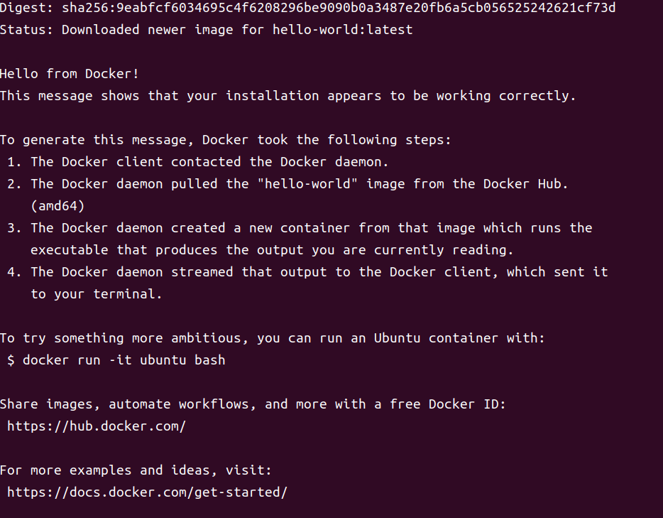

# 任务零：环境搭建 C 语言内核模块的编译和测试

参考唐洪雨的[最简驱动体验](https://thy1037.github.io/r4l-doc/c_01.html)。

## 环境搭建

### Docker 安装

为了统一开发环境，同时于其它开发环境做隔离，选择在 Docker 中做开发。

#### 卸载旧版本

```shell
sudo apt remove docker docker-engine docker.io containerd runc
```

其中：

- docker-engine 在 Debian 仓库中已不存在，所以可能会报错，删除后重新执行即可。

#### 使用仓库安装

Docker 支持多种安装方式，这里选择通过 apt 仓库的形式安装。

#### 设置仓库

更新 apt 包索引，并允许 apt 通过 HTTPS 使用仓库：

```shell
sudo apt update
sudo apt install ca-certificates curl gnupg
```

安装一些必要的软件包：

```shell
sudo apt-get install apt-transport-https ca-certificates curl software-properties-common
```

添加 Docker 的官方 GPG 密钥：

```shell
sudo install -m 0755 -d /etc/apt/keyrings
curl -fsSL https://download.docker.com/linux/debian/gpg | sudo gpg --dearmor -o /etc/apt/keyrings/docker.gpg
sudo chmod a+r /etc/apt/keyrings/docker.gpg
```

使用以下命令设置仓库：

```shell
echo \
  "deb [arch="$(dpkg --print-architecture)" signed-by=/etc/apt/keyrings/docker.gpg] https://download.docker.com/linux/debian \
  "$(. /etc/os-release && echo "$VERSION_CODENAME")" stable" | \
  sudo tee /etc/apt/sources.list.d/docker.list > /dev/null
```

添加 Docker 的仓库：

对于 Ubuntu 20.04 (Focal Fossa) 和更高版本：

```shell
echo "deb [arch=$(dpkg --print-architecture) signed-by=/usr/share/keyrings/docker-archive-keyring.gpg] https://download.docker.com/linux/ubuntu $(lsb_release -cs) stable" | sudo tee /etc/apt/sources.list.d/docker.list > /dev/null
```

对于 Ubuntu 18.04 (Bionic Beaver)：

```shell
oslab@oslab-virtual-machine:~$ echo "deb [arch=$(dpkg --print-architecture) signed-by=/usr/share/keyrings/docker-archive-keyring.gpg] https://download.docker.com/linux/ubuntu $(lsb_release -cs) stable" | sudo tee /etc/apt/sources.list.d/docker.list > /dev/null
```

### 安装 Docker Engine

更新 apt 包索引：

```shell
sudo apt-get update
```

安装 Docker Engine, containerd 和 Docker Compose

```shell
sudo apt install docker-ce docker-ce-cli containerd.io docker-buildx-plugin docker-compose-plugin
```

通过运行 hello-world 镜像来确认 Docker Engine 安装成功：

```shell
sudo docker run hello-world
```

成功输出：



### Docter 配置

#### Qemu

```shell
apt install qemu-utils qemu-system-x86 qemu-system-gui
```

#### Busybox

```shell
apt install cpio
```

#### 编译依赖

```shell
apt -y install \
  binutils build-essential libtool texinfo \
  gzip zip unzip patchutils curl git \
  make cmake ninja-build automake bison flex gperf \
  grep sed gawk bc \
  zlib1g-dev libexpat1-dev libmpc-dev \
  libglib2.0-dev libfdt-dev libpixman-1-dev
```

#### Clang

```shell
apt install clang-format clang-tidy clang-tools clang clangd libc++-dev libc++1 libc++abi-dev libc++abi1 libclang-dev libclang1 liblldb-dev libllvm-ocaml-dev libomp-dev libomp5 lld lldb llvm-dev llvm-runtime llvm python3-clang
```

#### 编译器

根据开发环境，下载的是 gcc-linaro-7.5.0-2019.12-x86_64_arm-linux-gnueabihf.tar.xz。

解压后将 gcc-linaro-7.5.0-2019.12-x86_64_arm-linux-gnueabihf/bin 添加进环境变量，便于后续使用。

## C 驱动开发

首先编写模块的必要代码

```C
// file name: hellomodule.c

#include <linux/module.h>
#include <linux/init.h>
#include <linux/kernel.h>

static int __init hello_init(void) {
    printk("[ default ] Hello Module Init\n");
    return 0;
}

static void __exit hello_exit(void) {
    printk("[ default ] Hello Module Exit\n");
}

module_init(hello_init);
module_exit(hello_exit);

MODULE_LICENSE("GPL2");
MODULE_AUTHOR("THY");
MODULE_DESCRIPTION("hello module");
MODULE_ALIAS("test_module");
```

其中：

- module_init(hello_init) 用来指定模块的初始化函数，在 insmod 时被调用
- module_init(hello_exit) 用来指定模块的初始化函数，在 rmmod 时被调用
- MODULE\_\* 用来指定模块的相关信息，在 modinfo 时被调用

### 编译

```Makefile
# file name: Makefile

KERNRL_DIR = /path/to/src/linux-6.1.21

ARCH := arm64
CROSS_COMPILE := aarch64-linux-gnu-
PATH := $(PATH):/path/to/gcc-linaro-7.5.0-2019.12-x86_64_arm-linux-gnueabihf/bin
export ARCH CROSS_COMPILE PATH

obj-m := hellomodule.o

all:
    $(MAKE) -C $(KERNRL_DIR) M=$(CURDIR) modules

.PHONE: clean

clean:
    $(MAKE) -C $(KERNRL_DIR) M=$(CURDIR) clean

```

运行 make 后得到 hellomodule.ko 文件，将之放入根文件系统中。

### 测试模块

启动虚拟机，加载模块：

```
/ # insmod hellomodule.ko
hellomodule: loading out-of-tree module taints kernel.
hellomodule: module license 'GPL2' taints kernel.
Disabling lock debugging due to kernel taint
[ default ] Hello Module Init
```

可以看到有 hello_init() 中的输出内容，表明初始化函数被执行。
卸载模块：

```
/ # rmmod hellomodule.ko
[ default ] Hello Module Exit
```

可以看到有 hello_exit() 中的输出内容，表明卸载函数被执行。

查看模块信息：

```
/ # modinfo hellomodule.ko
filename:       hellomodule.ko
author:         THY
description:    hello module
license:        GPL2
alias:          test_module
depends:
vermagic:       6.1.21 SMP mod_unload ARMv7 p2v8
```
