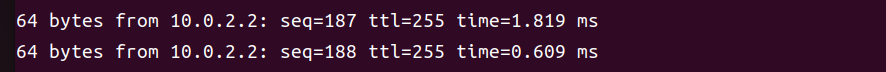
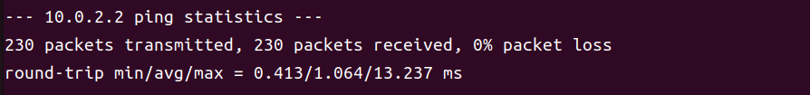

# 任务二：Linux 6.1 + R4L e10000网卡驱动 在 Qemu 中运行

配置完成后，在r4l-e1000文件目录下，执行：

```shell
bash ./build_image.sh
```

内核启动时，键入以下命令以安装驱动程序并配置网络接口：

```shell
insmod r4l_e1000_demo.ko
ip link set eth0 up
ip addr add broadcast 10.0.2.255 dev eth0
ip addr add 10.0.2.15/255.255.255.0 dev eth0 
ip route add default via 10.0.2.1 
```

然后，ping 主机以查看最终结果：

```shell
ping 10.0.2.2
```

可以看到成功ping通：



结束后返回结果：


